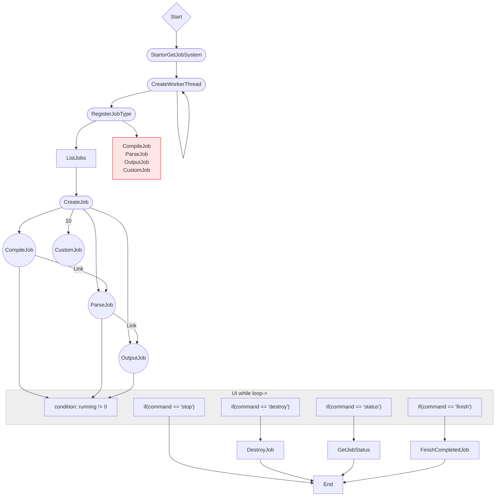
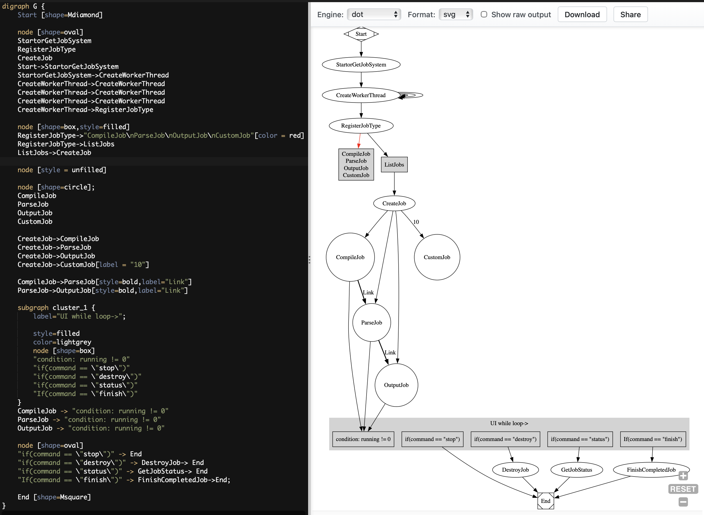

Source Code: [](https://github.com/JerMa88/automative_debug_assistant)

## Overview

- Utilized mutex locks to eliminate race conditions and deadlock prevention for job systems
- Used OpenAI API initiating REST interface to query the local LLM for iterative automatic responses
- Designed the UML diagram for software architecture design for the Operating System
- Accomplished parallel programming with Dask delay functions for faster iterative calculations on HPC
- Eliminated memory leaks on C++ Programs by checking uncollected data in memory using Valgrind
- The system fixes user’s code repeatedly until it is bug-free, giving user a worry-free debug experience



## Introduction
The Code Assistant Agent automatically generate a flowscript in dot file through LLM to initialize the automated job system that compiles C++ code. The Agent then carries the compiler errors and warnings to the LLM to automatically fixes the errors and warnings. The Agent will keep repeating the compiling and LLM Prompting and fixing process until the code works and the program compiles without errors. 

## Job System
The Job System implemented multithreading operations, incorporating various functionalities to enhance efficiency and reliability. Utilizing lock guards and unique locks for mutex handling, the system prioritizes safety by minimizing the risk of unintended deadlocks. It meticulously logs each step of error storage in txt, tsv, and a destination JSON file, ensuring secure storage on the system storage. The implementation enables a dependency between CompileJob, ParseJob, and OutputJob to guarantee sequential job processing and prevent premature job execution. Initialization involves creating threads, with a singleton JobSystem managing a unified job queue. Notably, CompileJob compiles programs, storing return codes and outputs, while ParseJob and OutputJob handle parsing and JSON file generation. The system also provides a user interface for user interaction and demonstrates its capabilities through Makefile-targeted operations, showcasing error output in a structured JSON format. Overall, the job system is adept at managing multithreading intricacies, ensuring data safety, and facilitating user-friendly control over job execution and monitoring.

## Shared Object and FFI
In the context of the Job_System from lab 1, communication is facilitated through FFI using JSON objects. This involves the usage of string interface containing serialized JSON data, with subsequent deserialization taking place within the Job_System after the JSON object is parsed by a Job System API. The FFI features include the ability to query Job 'handles,' descriptors providing information about Job status, allowing programs to block and wait for job completion. Additionally, the JobSystem supports the creation and operation of multiple jobs and threads, enabling registerable jobs to follow a specific constraint of consuming and returning String data.

In this lab I built each individual job into a separated .so library for dynamic handling, and I built the Job System API into a separated .so library for static handling of the library into tthe driver main function. SO files are essential for the implementation of this program wich constitute not only the string and JSON object interface but also the distribution and customizable job types.

## Flowscript
FlowScript is a domain-specific language (DSL) designed as an extension of the DOT language. Its primary objective is to allow users to design workflows and control flows visually while integrating scripting capabilities for conditions, loops, and function calls for the job system. The job system API is implemented in C++ and is designed to be used in conjunction with the FlowScript language. The job system API is called by parser based on the flowscript code to achieve certain operations and functionalities.

### Functionality
The implementation of FlowScript revolves around essential programming language elements, including Shapes, Pointers, and Structures. Shapes, representing jobs, condition statements, or data structures, are implemented with corresponding functions called in sequence. Pointers establish connections, denoting sequences, reads, writes, or dependencies between functions, data structures, or jobs. Structures, formed by combining shapes and pointers, represent entities like loops, while loops, or threads. The language, supporting both procedural and object-oriented paradigms, enables modular and reusable code design. FlowScript integrates the simplicity of DOT language with scripting power, offering a seamless process flow visualization experience. Users can easily design complex processes with its intuitive design, making it a versatile tool for various applications, detailed further in the accompanying example scripts in DOT language. Overall, FlowScript aims to revolutionize process flow visualization by providing a powerful yet user-friendly language.

### Objectives of FlowScript

FlowScript aims to revolutionize the way we visualize and design process flows by merging the simplicity of DOT with visualizing the structure of the job system. With its intuitive design, users can easily design complex processes, making it a potent tool for various applications.

The language supports both procedural and object-oriented paradigms, allowing users to design modular and reusable code. Each element of the language has been thoughtfully integrated with the DOT language, ensuring that the visual representation is as expressive as the script itself.

## FlowScript Parsing

The program parses the FlowScript DOT file and generates a visual representation of the program. The program also generates a JSON file containing the information of the program. The JSON file is then used to run the job system.

### FlowScript DOT File

The FlowScript DOT file is a DOT file with FlowScript elements. The program parses the DOT file and generates a automated compilation of the job system program. The program also generates a JSON file containing the functions that have been ran in the program.

### FlowScript Interpreter

The program Interpreter parses the direct lexicon of the DOT file line by line, and generates the syntactical JSON string API by analysing the line's lexicon. Interpret and execute individual logical units (lines with "->") of the DOT flow script one at a time, and repeat until end of script is reached 

Pros: more flexibility on FlowScript execution logic; easier to debug as the program will terminate where it meets an error; no sytactical errors by the users as syntax is automated generated based on the lexicon.

Cons: slower execution

### FlowScript Lexicon

The program will only run when a line contains "->" which constitutes certain logical units. The program will then parse the line and generate a JSON string API, which is the syntax. The rest of the code is for the visualization of the program structure. 

### FlowScript Syntax

After the lexicon parsing, the program will execute the syntax through the job system API so the program can be run by initializing the job system function through JSON string interface. The syntax is generated by the lexicon parsing line by line and the function that is executed is stored in ./Data/functions_executed.json.

### Developer Documentation on Error Types

Some lexicon errors, especially runtime errors are not captured by the program, since as long as there is a valid function, the program will try to constitute through job system API. Thus, it is user's responsibility to test if the dot file compile in a markdown file, which alos reduces runtime and logical errors. However, the program will vertainly catch semantic lexicon errors when the initializing function is not properly set up or does not exits in the job system. The program will terminate when it meets an fatal error, and will try to ignore an invalid entry, only printing an error message when trying to run the rest of the program. 
There are different levels of errors: the lower levels (job system, API) include file open/close errors, unregistered job errors, json loading/parding errors. The higher levels (parsing) include lexicon errors (iteration not integers, invalid function name, etc).

### Check out the full FlowScript DOT syntax rule in ./Report/flowscript.md

## GPT4ALL API
With openai library in python3, a group of res statement was bundled into Completion.create function. The function takes in the model, prompt and other parameters to return a JSON object containing the generated response. With a local api base localhost:4891, a api key is not needed to access the API. teh LLM are on the local machine, which does not rely on openai or other cloud services to generate response. This means that GPT4ALL is needed to be installed and opened on the local machine to generate a response by the program.

## LLMJob
An implementation of a child class of Job parent class called LLMJob allows the prompt to to formulated before being passed into the LLM API. Since LLM would not treat a json string with the best parsing, LLMJob reads error.json and parses the JSON objects of each error into a prompt that is more natural language for the LLM to understand. The LLMJob then sends the prompt to the LLM API and returns a JSON object containing the generated response. The LLMJob then writes the generated response to the Data/LLMOutput.json file. This entire functionality is automatcally achieved through the execution of Code/main.cpp based on the json string API implemented in lab 2, and the job system implemented in lab 1. Hence, before user input "finish" to complete the callback to the LLMJob, the LLMJob is automatically executed and the Code/LLMOutput.json file is generated.

WARNING: THE GPT4ALL MAY TAKE SECONDS TO A MINUTE TO INITIATE AND TO GENERATE A RESPONSE. PLEASE BE PATIENT FOR THE RESPONSE.

## Shared Object and FFI
A new command line is added in makefile to generate a .so shared object file to integrate the LLMJob library. 

## LLMJob Integration
In the main program, the LLMJob is integrated into the job system. The LLMJob is first added into the job list with RegisterJobType function, and then created with CreateJob function. In order to run the LLMJob after OutputJob, the LLMJob is added into the OutputJob's dependency pointer with the LinkJob function. JobCompletedCallBack function is not essential to functionality but to report to the user the completion of job upon user prompting "finish".

### LLM Models
2 LLMs are used for this lab: "orca-2-7b.Q8_0.gguf" which was downloaded from https://huggingface.co/TheBloke/Orca-2-7B-GGUF/tree/main and sideloaded into GPT4ALL; GPT4ALL Falcon (file name: "gpt4all-falcon-q4_0.gguf") from the GPT4ALL download tab.

## Prompt Requirements
To accommodate the LLM's understanding of the program, the prompt is generated by reading the error.json file and parsing the JSON objects of each error into a prompt that is more natural language for the LLM to understand. The LLMJob then sends the prompt to the LLM API and returns a JSON object containing the generated response. The LLMJob then writes the generated response to the Data/LLMOutput.json file. After error.json is parsed, the prompt is prepended with a paragraph explaining the context of jobsystem and the compiler errors passed from the error.json file. More context was given to the LLM by prepending the prompt with a paragraph demanding output for each error. Refer to the example prompt and response below.

## Example Prompts and Responses
### Prompt
```
My JobSystem is a custom build concurrency program that will try compiling a program, parse the error and eventually output the error message thown by the compiler. The error message outputs each individual errors and warnings, containing the file and the line and column in the file which the error occured in, the error/warning message and eventually the snippet of code the error occured in. I want you to examine each error, and give me a debug solution for each every single error and warning. First, give an explanation of why the file did not compile, and second give the fixed code in the context of the error. For each error/warning, I want you to ouput why the compiler error/warning exist, what is the fix, and finally the code snippet that corrects the code where the error is at. 

Here is the error message:
Compiler error #1 in file ./Code/lib_job_system/samplecode/cat.h at line 7 and column 10. Compiler message prints:  error: extra qualification on member 'Cat'The context of the code is: class Cat : Animal
{
    Cat::Cat(const std::string &name, int age, const std::string &breed);

    std::string breed; 


Compiler error #2 in file ./Code/lib_job_system/samplecode/cat.cpp at line 18 and column 67. Compiler message prints:  error: expected '}'The context of the code is: void Cat::foo()
{
    std::cout << This is the foo function for Cat. << std::endl;


Compiler error #3 in file ./Code/lib_job_system/samplecode/syntaxerror.cpp at line 1 and column 19. Compiler message prints:  error: expected '>'The context of the code is: #include <iostream
#include <String>


Compiler warning #4 in file ./Code/lib_job_system/samplecode/syntaxerror.cpp at line 2 and column 10. Compiler message prints:  warning: non-portable path to file '<string>'; specified path differs in case from file name on disk [-Wnonportable-include-path]The context of the code is: #include <iostream
#include <String>

#include animal.h


Compiler error #5 in file ./Code/lib_job_system/samplecode/syntaxerror.cpp at line 13 and column 17. Compiler message prints:  error: expected member name or ';' after declaration specifiersThe context of the code is:     void linkerError();

    std::string = Hello World!n;
    int i = 0
    return string;


Compiler error #6 in file ./Code/lib_job_system/samplecode/syntaxerror.cpp at line 14 and column 14. Compiler message prints:  error: expected ';' at end of declaration listThe context of the code is: 
    std::string = Hello World!n;
    int i = 0
    return string;
}


Compiler error #7 in file ./Code/lib_job_system/samplecode/syntaxerror.cpp at line 16 and column 2. Compiler message prints:  error: expected ';' after classThe context of the code is:     int i = 0
    return string;
}


```

### Example Response (by Falcon: preffered LLM)
```

Compiler error #1 in file ./Code/lib_job_system/samplecode/cat.h at line 7 and column 10
Compiler message prints:  error: extra qualification on member 'Cat'
The context of the code is: class Cat : Animal
{
    Cat::Cat(const std::string &name, int age, const std::string &breed);

    std::string breed; 
}


Compiler error 2 in file ./Code/lib_job_system/samplecode/cat.cpp at line 18 and column 67
Compiler message prints:  error: expected '}'
The context of the code is: void Cat::foo()
{
    std::cout << This is the foo function for Cat. << std::endl;
}


Compiler error 3 in file ./Code/lib_job_system/samplecode/syntaxerror.cpp at line 1 and column 19
Compiler message prints:  error: expected '>'
The context of the code is: #include <iostream>
#include animal.h
#include <string>
#include animal.h


Compiler warning 4 in file ./Code/lib_job_system/samplecode/syntaxerror.cpp at line 2 and column 10
Compiler message prints:  warning: non-portable path to file '<string>'; specified path differs in case from file name on disk [-Wnonportable-include-path]
The context of the code is: #include <iostream>
#include <String>
#include animal.h


Compiler error 5 in file ./Code/lib_job_system/samplecode/syntaxerror.cpp at line 13 and column 17
Compiler message prints:  error: expected member name or ';' after declaration specifiers
The context of the code is:     void linkerError();
std::string = Hello World!n;
int i = 0
return string;


Compiler error 6 in file ./Code/lib_job_system/samplecode/syntaxerror.cpp at line 14 and column 14
Compiler message prints:  error: expected ';' at end of declaration list
The context of the code is: std::string = Hello World!n;
int i = 0
return string;


Compiler error 7 in file ./Code/lib_job_system/samplecode/syntaxerror.cpp at line 16 and column 2
Compiler message prints:  error: expected ';' after class
The context of the code is:     int i = 0
return string;


Compiler error 8 in file ./Code/lib_job_system/samplecode/syntaxerror.cpp at line 16 and column 2
Compiler message prints:  error: expected ';' after class
The context of the code is:     int i = 0
return string;


Compiler error 9 in file ./Code/lib_job_system/samplecode/syntaxerror.cpp at line 16 and column 2
Compiler message prints:  error: expected ';' after class
The context of the code is:     int i = 0
return string;


Compiler error 10 in file ./Code/lib_job_system/samplecode/syntaxerror.cpp at line 16 and column 2
Compiler message prints:  error: expected ';' after class
The context of the code is:     int i = 0
return string;


Compiler error 11 in file ./Code/lib_job_system/samplecode/syntaxerror.cpp at line 16 and column 2
Compiler message prints:  error: expected ';' after class
The context of the code is:     int i = 0
return string;


Compiler error 12 in file ./Code/lib_job_system/samplecode/syntaxerror.cpp at line 16 and column 2
Compiler message prints:  error: expected ';' after class
The context of the code is:     int i = 0
return string;


Compiler error 13 in file ./Code/lib_job_system/samplecode/syntaxerror.cpp at lin


```
See Data/LLMOutput.json for the full json output.

### Troubles with LLM Generations
#### 1.
Resolved: if only passing in the error.json string, the LLM would generate a response that is not accuratly interpreted, with false determination of language, limited understanding of the program and lack of knowing the structure of the program. To solve this problem, I parsed the error.json string into a prompt that is more natural language for the LLM to understand. The prompt is generated by reading the error.json file and parsing the JSON objects of each error into a prompt that is more natural language for the LLM to understand. The LLMJob then sends the prompt to the LLM API and returns a JSON object containing the generated response. The LLMJob then writes the generated response to the Data/LLMOutput.json file.
##### Demonstration
```
Compiler error #1 in file ./Code/lib_job_system/samplecode/cat.h at line 7 and column 10. Compiler message prints:  error: extra qualification on member 'Cat'The context of the code is: class Cat : Animal
{
    Cat::Cat(const std::string &name, int age, const std::string &breed);

    std::string breed; 

```
instead of: 
```
{
    "return code": 512,
    "output": [
        [
            {
                "file": "./Code/lib_job_system/samplecode/cat.h",
                "line": "7",
                "column": "10",
                "error": " error: extra qualification on member 'Cat'",
                "codeSnippet": "class Cat : Animal\n{\n    Cat::Cat(const std::string &name, int age, const std::string &breed);\n\n    std::string breed; \n"
            }
        ]
   ]
}
```

#### 2. 
Need Improvement: Unlike ChatGPT by OpenAI, both orca and Falcon have an annoying tendency of generating a question or only debugging one bug at a time to wait for the user responce. Though maybe more interactive and beneficial in engagement of being a chatbot, this is not the desired behavior for the LLM API to generate a one time response for the user. I attempted to solve this problem with instructing the LLM to process each every single error in the prompt, but orca would still only debug one bug at a time. Falcon is now able to debug all the bugs in the prompt, but it has a wierd formatting in its response that make the code segments look wierd, but I am quite satisfied with Falcon's response as it give the reason for the error and the solution to the error.

#### 3.
Resolved: I accidentally used .upper in python on my command prompt, making the LLMJob generated prompt always capitalized when passed into the server. Disrupted the camelCase naming convention and LLM's basic understanind in C++ but now resolved.


## Conclusion
The Agent uses the REST interface to prompt a GPT-generated response in the form of a JSON object by GPT4ALL. As the user generates the job system and generates a error.json output what was implemented in lab 1, with a json string API implemented in lab 2. This lab implements the program which send a request to the GPT4ALL API to return a JSON file containing the generated LLM response. The LLMJob is integrated into the job system. The LLMJob is first added into the job list with RegisterJobType function, and then created with CreateJob function. In order to run the LLMJob after OutputJob, the LLMJob is added into the OutputJob's dependency pointer with the LinkJob function. JobCompletedCallBack function is not essential to functionality but to report to the user the completion of job upon user prompting "finish". The LLMJob is able to generate a response that is more natural language for the LLM to understand. The LLMJob then sends the prompt to the LLM API and returns a JSON object containing the generated response. The LLMJob then writes the generated response to the Data/LLMOutput.json file. The LLMJob is able to generate a response that is more natural language for the LLM to understand. The LLMJob then sends the prompt to the LLM API and returns a JSON object containing the generated response. The LLMJob then writes the generated response to the Data/LLMOutput.json file. The LLMJob is able to generate a response that is more natural language for the LLM to understand. The LLMJob then sends the prompt to the LLM API and returns a JSON object containing the generated response. The LLMJob then writes the generated response to the Data/LLMOutput.json file. The LLMJob is able to generate a response that is more natural language for the LLM to understand. The LLMJob then sends the prompt to the LLM API and returns a JSON object containing the generated response. The LLMJob then writes the generated response to the Data/LLMOutput.json file. The LLMJob is able to generate a response that is more natural language for the LLM to understand. The LLMJob then sends the prompt to the LLM API and returns a JSON object containing the generated response. The LLMJob then writes the generated response to the Data/LLMOutput.json file.

