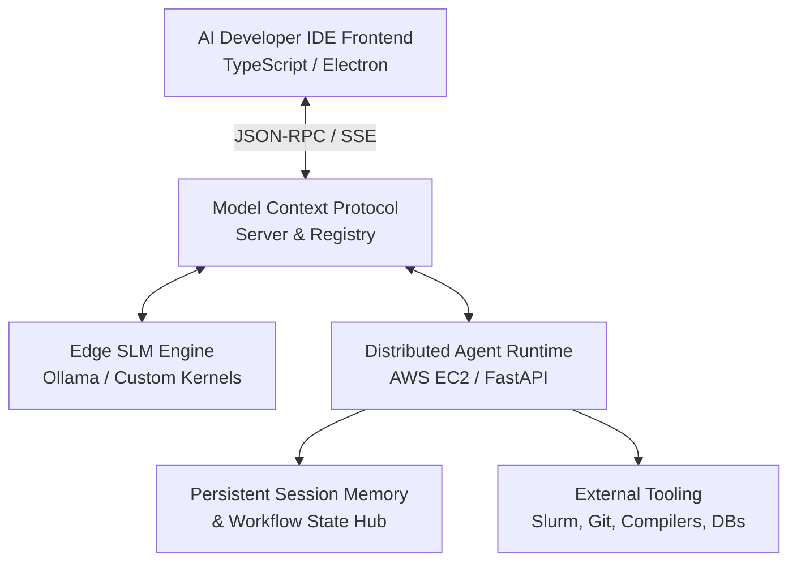

# Custom AI Development IDE & Agent Runtime

## Overview
Architected a modular, extensible AI development environment and distributed agent runtime designed to orchestrate complex, multi-turn tool-calling workflows across heterogeneous local and cloud LLMs. The platform integrates Anthropic's **Model Context Protocol (MCP)**, providing unified, secure context and tool integration for autonomous developer agents.

## System Architecture & Features

### 1. Model Context Protocol (MCP) Orchestration
- Implemented full MCP client and server specifications, enabling autonomous agent delegation across filesystem navigation, terminal executions, git workflows, and remote database queries.
- Standardized tool schema generation and validation for low-latency function calling.

### 2. Scalable Cloud Agent Runtime & Workflow Hub
- Engineered a distributed agent execution backend on **AWS EC2** using **FastAPI** and **Docker**, supporting persistent conversation history, checkpointing, and real-time execution streaming.
- Built a collaborative workflow hub enabling developers to publish, share, and dynamically compose multi-agent task recipes.

### 3. Edge SLM Inference Optimization
- Engineered an optimized local edge inference pipeline tailored for short-context Small Language Models (SLMs).
- Minimized invocation latency and token consumption, allowing reactive agent decision loops to execute with near-zero overhead.
