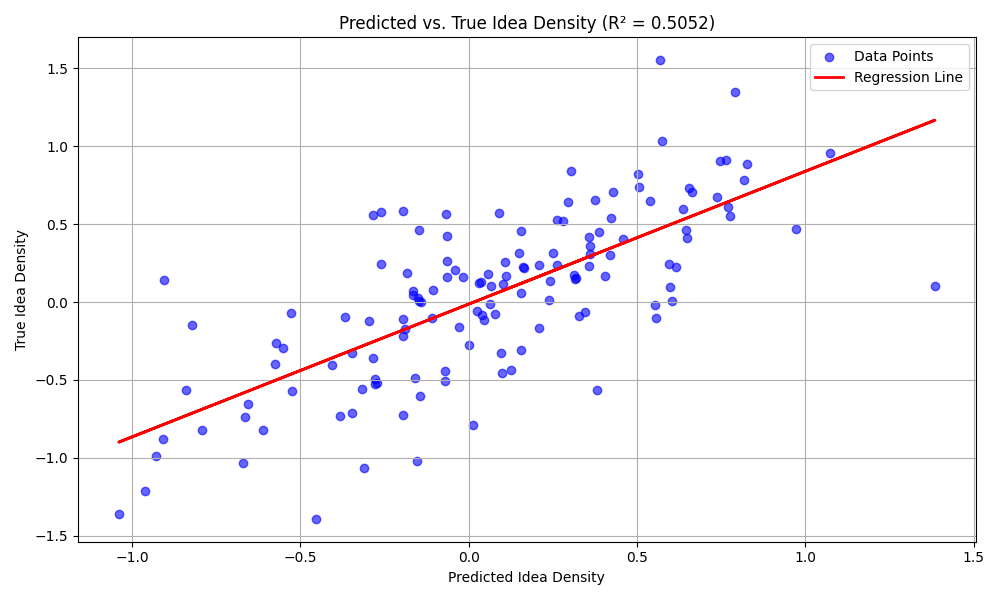
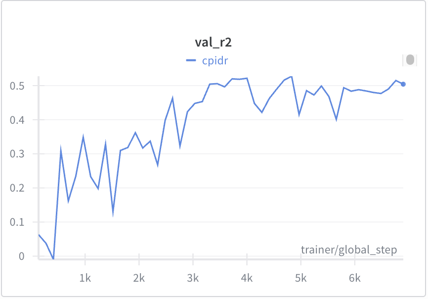
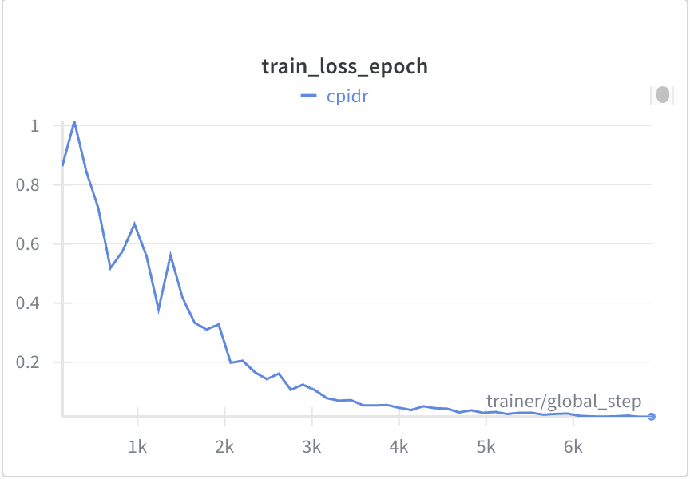
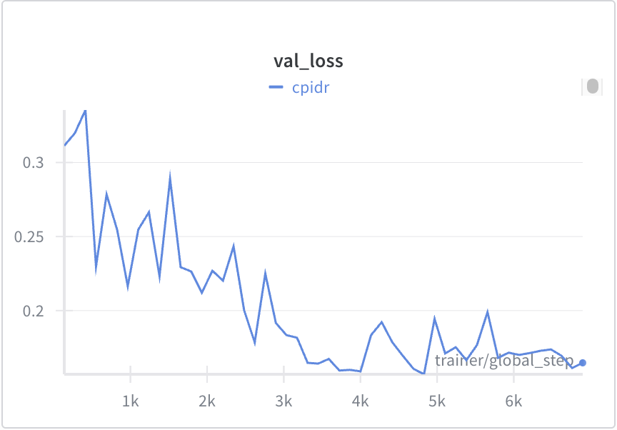

# Idea Density Prediction with LLaMA

## Abstract
This report presents a study on predicting idea density (ID) scores from long-form text data using a modified LLaMA3.2:1b model. Although the model achieved moderate success despite being trained on a relatively small dataset (1300+ data points), the computational expense and convergence challenges indicate avenues for improvement.

## Data Description
* Dataset: Transcripts from patient life narrative interviews.
* Data Points: Over 1300 entries, maximum word count capped at 10,000 words for computational efficiency.
* Target Variable: Normalized idea density scores, derived from the CPIDR (Computerized Psychometric Index for the Detection of Idea Density) tool, which quantifies the number of ideas per 100 words in a text sample.

## Model Architecture
The model comprises two main components:

1. Pretrained LLaMA3.2:1b:

    - Initially pretrained on large-scale data.
    - Quantized for bfloat16 precision.
    - Adapted using LoRA (Low-Rank Adaptation) and integrated with PEFT (Parameter-Efficient Fine-Tuning) to reduce computational load and mitigate overfitting.

1. Regressor Head:

    - A single-layer perceptron attached to the last layer of the prediction head of the decoder.
    - Designed to predict normalized personality scores derived from patient questionnaires.

## Experimental Setup
* Training Details:

    - Epochs: 100
    - Duration: 48 hours
    - Learning Rate: 2e-5
    - Batch Size: 1

* Hardware:

    - Utilized Distributed Data Parallel (DDP) training.
    - Employed 6 NVIDIA A100 GPUs on SuperPOD, each leveraging approximately 70 GB of VRAM.

* Resource Consumption:

    - Memory Footprint: Approximately 0.94 GB.
    - Trainable Parameters: Only 0.137% of the total 1.2 billion parameters are trainable due to PEFT.

## Performance Metrics
Test Mean Squared Error (MSE): 0.1463

Test Mean Absolute Error (MAE): 0.2863

Test R² Score: 0.5052

*Interpretation*:
About **50.52% of the variance in the idea density scores** can be explained by this model. That’s a decent signal so far, especially given the complexity of natural language and the small dataset.

R ≈ 0.7108,
indicates a moderate to strong positive linear relationship between the predicted and actual idea density scores

## Discussion
### Computational Efficiency
While the results are promising, they come with high computational demand:

* VRAM Scalability:
    The VRAM consumption scales quadratically with sequence length, making the use of long texts (10,000 words per data point) particularly inefficient for regression tasks.

* Model Suitability:
    Decoder models like LLaMA can yield sufficient regression results but may not be the most cost-effective option. Instead, models such as BERT or RoBERTa might be more appropriate due to their lower memory requirements and training time.

### Convergence and Overfitting
* Convergence Issues:
    Due to the limited number of data points (1300), convergence remains a challenge.
* Overfitting:
    Although the training loss remains less than 0.1, the validation loss is persistently higher at approximately 0.15, indicating slight overfitting.
* Future Directions:
    An increase in the amount of training data (to the millions of data points) and adopting shorter text inputs could accelerate the training process and improve generalization.

## Conclusion
This preliminary study demonstrates the feasibility of using the decoder LLMs like LLaMA3.2 for predicting idea density scores. However, the observed issues regarding computational inefficiency, convergence, and overfitting highlight the need for further adjustments. Future work should focus on using more data and exploring alternative models better suited to the task.

## Future Work
As it is proven that LLaMA model can predict objective linguistic metrics, in this experiment, idea density scores, to some extent, the following strategies can be employed to enhance model performance:
* Model Selection:
    - Experiment with encoder models like Mamba (linear attention), BERT or RoBERTa (bidirectional encoders) for potentially better efficiency and performance.
* Data Augmentation:
    - Increase the dataset size to improve model generalization and convergence.
* Data Resampling:
    - Use shorter text inputs to reduce computational load and training time.
    - methodologies may be found in [Data Balancing Strategies: A Survey of Resampling and Augmentation Methods](https://arxiv.org/pdf/2505.13518)