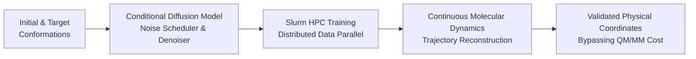

# Conditional Diffusion Models for Protein Trajectories (PyTAO)

## Overview
Sampling continuous molecular dynamics and conformational transitions of proteins typically requires computationally prohibitive quantum mechanical / molecular mechanics (QM/MM) calculations. In collaboration with **Dr. Peng Tao's Proteins and Computers Lab** at SMU, we designed and trained conditional diffusion generative models capable of directly generating continuous biomolecular conformational trajectories from boundary structural coordinates, bypassing thousands of CPU/GPU hours of physics simulations.

This work culminated in a research publication in the **Journal of Chemical Theory and Computation (ACS, 2026)** and the open-source **PyTAO** computational chemistry and trajectory toolkit.

## Highlights & Engineering

### 1. Conditional Generative Diffusion
- Implemented deep generative diffusion models conditioned on 3D Cartesian coordinates and learned invariant spatial representations.
- Reconstructed high-dimensional protein conformational trajectories with realistic bond angles and non-bonded interactions.

### 2. High-Performance Distributed Training (DDP)
- Developed Slurm parallel batch training scripts leveraging PyTorch Distributed Data Parallel (DDP) across high-performance GPU clusters.
- Optimized tensor transformations and memory-mapped trajectory datasets for rapid epoch turnover.

### 3. Open-Source PyTAO Toolkit
- Built, tested, and released the **PyTAO** open-source Python library, integrating ONIOM calculation automation, coordinate parsing, and Slurm HPC job monitoring for computational chemistry workflows.

## Publication
* **Efficient sampling of short protein trajectories with conditional diffusion models**  
  Chen Xiong, Praveen Kandhan, Dong Chen, Zerui Ma, Eric D. Smith, Peng Tao.  
  *Journal of Chemical Theory and Computation* (ACS), 22(1), 78 (2026).  
  DOI: [10.1021/acs.jctc.5c01089](https://doi.org/10.1021/acs.jctc.5c01089).
