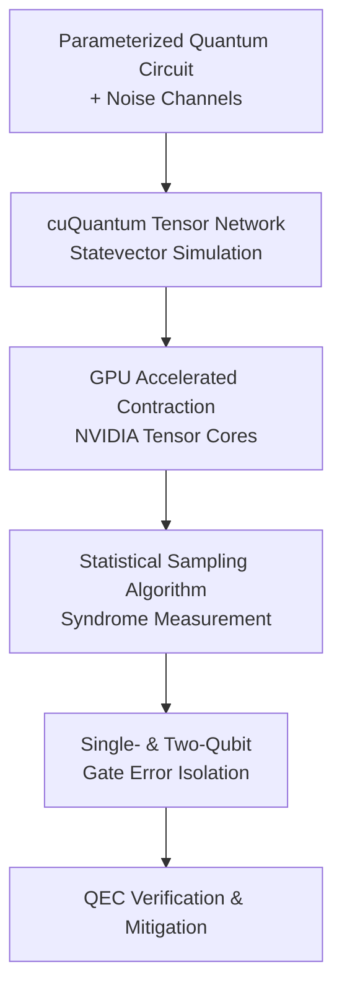

# GPU-Accelerated Quantum Error Detection

## Overview
As quantum processors scale into the Noisy Intermediate-Scale Quantum (NISQ) era, characterization and mitigation of gate errors are essential for achieving fault-tolerant quantum computation. This research project presents a high-throughput, GPU-accelerated quantum simulation pipeline that accurately models stochastic Pauli error channels using NVIDIA **cuQuantum** tensor-network backends and **Qiskit**.

## Research & Engineering Highlights

### 1. High-Performance Tensor-Network Simulation
- Modeled realistic quantum noise using stochastic Pauli channels ($X, Y, Z$ depolarizing noise) integrated into multi-qubit parameterized quantum circuits.
- Accelerated statevector generation and tensor contractions leveraging NVIDIA **cuQuantum Appliance** and custom CUDA routines, achieving order-of-magnitude speedups over classical CPU simulator backends.

### 2. Statistical Error Syndrome Sampling
- Developed a statistical sampling algorithm capable of localizing single-qubit and two-qubit entangling gate errors with minimal measurement overhead.
- Reduced the syndrome extraction rounds required to verify circuit fidelity under high-depth algorithmic circuits.

### 3. Scalable QEC Verification
- Currently drafting a journal publication formalizing this methodology as an efficient verification protocol for Quantum Error Correction (QEC) schemes on near-term hardware.

## Publication Status
* **Scalable Quantum Error Detection via Tensor-Network Statevector Sampling** (2026). *In Preparation for Journal Submission*. Primary Author: Zerui "Jerry" Ma.
