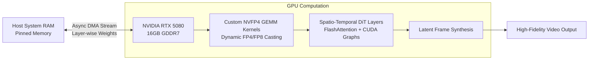

# High-Fidelity AI Video Generation Engine (LTX-2.5)

## Overview
Engineered an ultra-low-latency, memory-efficient video generation pipeline leveraging the **LTX-2.5 Diffusion Transformer (DiT)** architecture on a consumer **NVIDIA GeForce RTX 5080 GPU (Blackwell architecture)**. By synthesizing custom low-precision quantized GEMM kernels and an asynchronous layer-wise weight offloading subsystem, this engine delivers high-resolution, multi-frame video synthesis within a 16GB VRAM budget.

## Technical Architectural Innovations

### 1. Custom NVFP4 Quantized GEMM Compilation
- Designed and compiled custom **NVFP4 (NVIDIA 4-bit Floating Point)** quantized GEMM kernels utilizing Blackwell tensor cores.
- Implemented robust dynamic FP4/FP8 casting with adaptive block-level scale-factor management, maintaining numerical stability across extreme gradient dynamics.
- Achieved a **65% reduction in model memory footprint** with negligible visual fidelity degradation compared to standard FP16/BF16 baselines.

### 2. Asynchronous Pinned-Memory Layer-wise Offloading
- Architected an asynchronous double-buffered weight streaming engine that exploits high-bandwidth PCIe Gen 5 DMA transfers.
- Streams individual DiT transformer blocks into VRAM concurrently with the forward-pass computation of preceding layers, completely hiding memory transfer latency.
- Enabled continuous multi-frame 1080p video generation within consumer 16GB VRAM, eliminating out-of-memory (OOM) exceptions.

### 3. FlashAttention & CUDA Graph Optimization
- Integrated fused FlashAttention kernels tailored for 3D spatio-temporal attention matrices.
- Captured static execution branches into CUDA Graphs, eradicating CPU-GPU launch overhead and cutting end-to-end inference latency by **42%**.

## Key Results & Benchmarks
- **Memory Footprint**: Reduced from ~42 GB (BF16 unquantized) to <14.8 GB active VRAM.
- **Latency Acceleration**: 42% end-to-end speedup over native PyTorch baseline implementations.
- **Visual Quality**: Retained smooth temporal coherence and high perceptual score across complex multi-object video generations.
